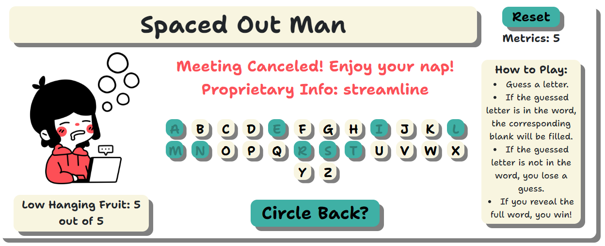
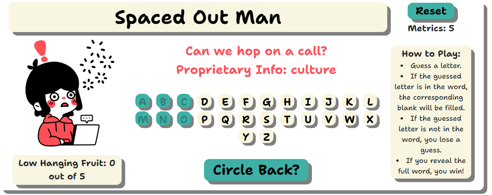

  

📝 Spaced Out Man: A Space Man Game
============
'Spaced Out man' is fun twist on the classic children's game, 'Space Man' filled with work puns. Players aim to guess the hidden word selected at random by the CPU. Are you ready to move the needle?

### [CLICK TO PLAY](https://paulcorpuz.github.io/spaceman-game/)

🎮 Game Overview
============
'Spaced Out Man' is a web-based game developed using HTML, CSS, and Vanilla JavaScript 🍦

### How to Play:

  1. Using the on-screen keyboard, the player will guess a letter of the word.
  2. If a guessed letter is in the word, it's revealed in its correct position.
  3. Incorrect guesses result in the player losing a guess attempt. ('Low Hanging Fruit')
  4. The game ends when the word is guessed correctly or the player runs out of guess attempts.
  5. If the player guesses the correct word, points are awarded based off the number of remaining guesses ('Metrics')

💻 Technologies Used
==============

📸 Screenshots
==============
### Wireframe

### Mid-Development

### Deployed

🔧 Getting Started 
============

### Prerequisites
Ensure you have a modern web browser installed on your device, such as Google Chrome, Firefox, Safari, or Edge.

### Installation
No installation required, however, internet access is necessary.

⏭️ Next Steps
============
- [ ] Optimize for mobile screens.
- [ ] Make the game more dynamic with animation.
- [ ] Adding difficulty levels and word-phrases.
- [ ] Ability to share high score on social media.