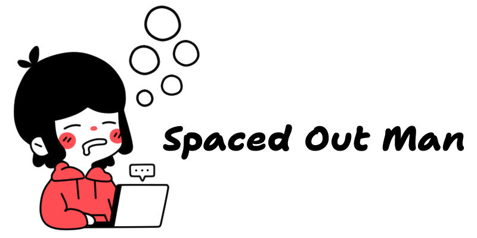
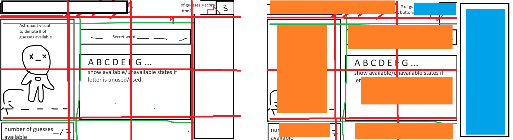
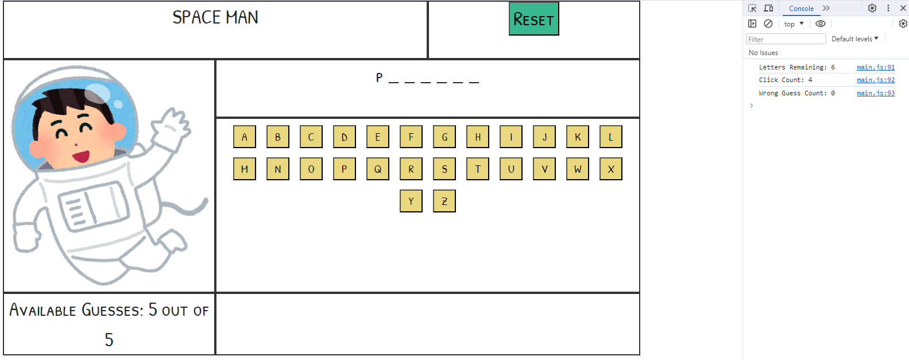
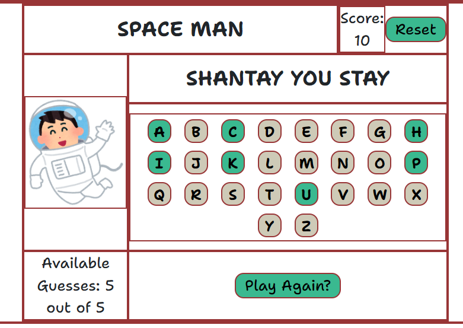

  

# Spaced Out Man

### [CLICK TO PLAY](https://paulcorpuz.github.io/spaceman-game/)

##### Paul Corpuz

📝 Description
============
Project One is a Space Man game inspired by the classic children's game. Players aim to guess the hidden word selected at random by the CPU.

  
How to Play

    1. Using the on-screen keyboard, the player will guess a letter of the word.
    2. If a guessed letter is in the word, it's revealed in its correct position.
    3. Incorrect guesses result in the player losing a guess attempt.
    4. The game ends when the word is guessed correctly or the player runs out of guess attempts.

💻 Technologies Used
==============
  
  
  
  
  
  

📸 Screenshots
==============

Original Wireframe

  

Mid-development

  
  
  

Deployed Demo

🔧 Getting Started 
============

  
Planning and Wireframe

      1. WIP
      2. WIP
      3. WIP

  
Applied Learning - JS DOM Manipulation

      1. WIP
      2. WIP
      3. WIP

    
Challenges and Roadblocks

        1. WIP
        2. WIP
        3. WIP

  
Design

      1. WIP
      2. WIP
      3. WIP

⏭️ Next Steps
============
- [ ] Adding difficulty levels and word phrases.
- [ ] Make the game more dynamic with animation.
- [ ] Optimize for mobile screens
- [ ] Ability to share high score on social media